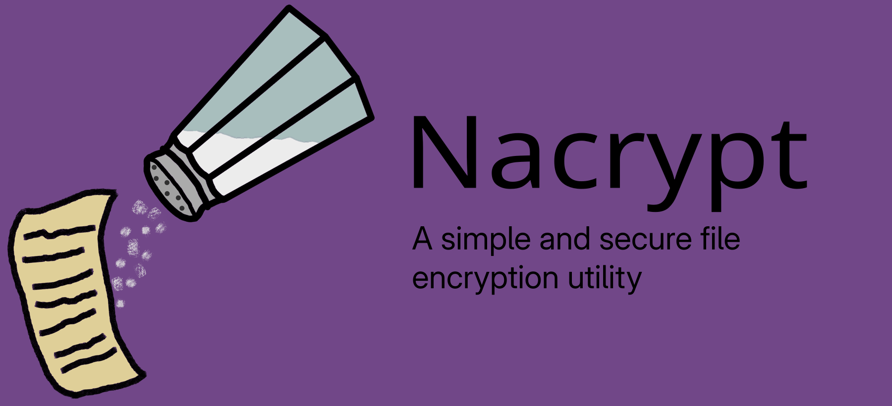

# Installation
Nacrypt is available on the [AUR](https://aur.archlinux.org/packages/nacrypt)<br>
To install it simply use your favorite AUR helper:
```sh
$ paru/yay -S nacrypt
```

## Alternative installation methods:
(for all of the following methods you must have [libsodium](https://doc.libsodium.org/installation) installed on your system)<br>

You can install nacrypt as a binary crate with cargo:
```sh
$ SODIUM_USE_PKG_CONFIG=1 SODIUM_SHARED=1 cargo install nacrypt
```
Or alternatively build from source:
```sh
$ cargo build --release
```

# Usage
```sh
Usage: nacrypt [OPTIONS] [INPUT]

Arguments:
  [INPUT]  The input file

Options:
  -o, --output <OUTPUT>                File to output to
  -e, --encrypt                        [optional] Specify encrypt mode
  -d, --decrypt                        [optional] Specify decrypt mode
  -g, --gen-key                        Generate a new keypair
  -R, --regen-public                   Regenerate your public key if it was lost
  -r, --recipient <RECIPIENTS>         Encrypt this file to recipient's public key
  -p, --private-key <SECRET_KEY_PATH>  Specify custom path to private key to use
  -v, --verbose                        Display verbose output
  -h, --help                           Print help
  -V, --version                        Print version
```

## Symmetric example
```sh
$ nacrypt input.txt -o encrypted.txt.enc
Please create a password:
Please re-enter the password:
Deriving key.. done
$ nacrypt encrypted.txt.enc -o decrypted.txt
Please enter password for encrypted.txt.enc:
Deriving key.. done
$ md5sum input.txt decrypted.txt
# hashes match
```

``` Asymmetric example
# Encrypt this file to the recipients, multiple can be specified with -r
$ nacrypt input.txt -o encrypted.txt.enc -r nacrypt_pubkey_ljuqJBpGxwO0i8WL3hLaXjxCc3Eg1iR6EGGEfc5ln3c= -r nacrypt_pubkey_8OkScyA4nWI8odCBftmcwFyaU3SxtRrFFeFLlMyZ0x8=

# On the side of one of the recipients:
$ nacrypt encrypted.txt.enc -o decrypted.txt
Please enter password for ~/.nacrypt/private.key:
Deriving key.. done
# Recipient now has the same file
```

# Security
File encryption is done using the `xchacha20poly1305` AEAD cipher providing confidentiality and integrity.<br>
The file encryption key is generated using the Argon2ID 1.3 key derivation function with `opslimit` and `memlimit` set to SENSITIVE (high settings)<br>
In asymmetric mode, a random file key is generated and sealed inside a `crypto_box` for each recipient.<br>
Private keys are stored on disk using a `crypto_secretbox` with the same KDF parameters as normal file encryption.

## Warning (post-quantum)
In asymmetric mode (no password), nacrypt currently uses libsodium's `crypto_box` which uses Curve25519. Curve25519 is susceptible to store-now-decrypt-later (SNDL) attacks from quantum computers, where an adversary stores encrypted files and waits until they have a suitably strong quantum computer to break the files in a couple of years/decades.

## Warning (signatures)
Nacrypt, like `age`, does NOT use digital signatures when encrypting files to recipients. This means it CANNOT verify the identity of the sender. If you wish to do this, please use nacrypt on top of a tool like minisign to provide signatures to verify sender's identities.
